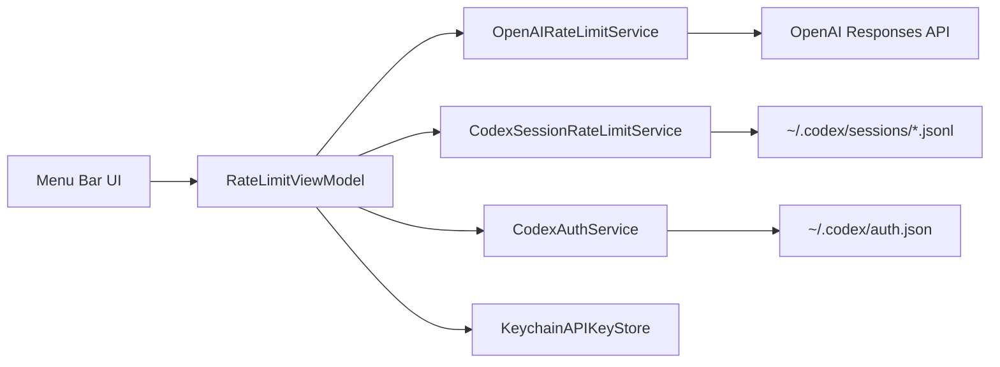

# RateLimitForCodex 📊✨

A lightweight macOS menu bar app to monitor OpenAI/Codex rate limits quickly, without opening a full dashboard.

## Agent-Built Project 🤖

This app is **100% built with Codex** and was intentionally created with **no manual coding**.

Primary goal:
- Serve as a practical learning project for understanding how to collaborate with coding agents.
- Demonstrate real agent workflow: prompting, iteration, code generation, refactoring, commit structuring, and shipping.

## What Is Not Shared 📦

To keep this repository focused and portable, the following are **not** shared here:
- `AGENTS.md` (local/private agent instruction file used during development)
- Internal planning artifacts (session plans, intermediate agent planning context)

This repo contains the resulting source code and documentation, not the full private agent runtime context.

## Purpose 🎯

`RateLimitForCodex` exists to answer one question fast:

**"How close am I to the limit right now?"**

It gives a live, glanceable view of:
- OpenAI API request/token limits (when using API key auth)
- Codex session usage windows (when using Codex login/session data)

## What Has Been Built ✅

### Core functionality
- macOS `MenuBarExtra` app (runs as accessory app, no dock icon).
- Two auth modes:
  - `Codex app`
  - `API key`
- Auto-refresh with selectable intervals (`60s`, `120s`, `300s`).
- Manual refresh button.
- Last check status + error messaging.

### Data sources
- **API mode:** `POST /v1/responses` and reads rate limit headers.
- **Codex mode:** parses local `~/.codex/sessions/*.jsonl` session files.
- **Codex account display:** reads `~/.codex/auth.json` and extracts email from JWT.

### UX decisions already applied
- Removed confusing "Check Codex session" action from auth UI.
- Removed logout button (it was misleading for OpenAI account-level sign-out).
- Kept refresh controls visible.
- Removed "Using recent Codex session data." label to reduce UI noise.

## Color + Graph System 🎨📈

The app uses a simple traffic-light threshold model:

- 🟢 `0% - 29%` -> healthy
- 🟠 `30% - 59%` -> caution
- 🔴 `60%+` -> high usage

### Emoji graph examples

- `12%`  -> 🟩⬜⬜⬜⬜
- `45%`  -> 🟨🟨⬜⬜⬜
- `78%`  -> 🟥🟥🟥🟥⬜
- `96%`  -> 🟥🟥🟥🟥🟥

Menu bar also shows dual progress bars for Codex primary/secondary windows with percentage labels.

## How It Works (High Level) 🧠

## Project Layout 🗂️

- `Codex rate limit/Codex_rate_limitApp.swift`
  - App entry point and menu bar wiring.
- `Codex rate limit/ViewModels/RateLimitViewModel.swift`
  - Main state machine, refresh loop, auth switching.
- `Codex rate limit/Services/`
  - `OpenAIRateLimitService.swift`
  - `CodexSessionRateLimitService.swift`
  - `CodexAuthService.swift`
  - `KeychainAPIKeyStore.swift`
  - `AppEnvironment.swift`
- `Codex rate limit/UI/`
  - `MainMenuView.swift`, `MenuBarLabelView.swift`
  - `AuthenticationSectionView.swift`, `AutoRefreshSectionView.swift`
  - `CodexProgressSectionView.swift`, `MetricRowView.swift`
- `Codex rate limit/Models/RateLimitModels.swift`
  - Shared snapshot/auth models.

## Run Locally 🚀

1. Open `Codex rate limit.xcodeproj` in Xcode.
2. Select scheme: `Codex rate limit`.
3. Build/run for macOS.
4. Use either:
   - Codex login mode (reads local Codex session/auth files), or
   - API key mode (key stored in Keychain).

## Important Notes ⚠️

- This app is **macOS-only** (`SUPPORTED_PLATFORMS = macosx`).
- Current project target is `MACOSX_DEPLOYMENT_TARGET = 26.1` in project settings.
- "Codex mode" depends on local Codex files existing and being recent.
- No true account logout flow is implemented (by design).

## Commit History Split (for clarity) 🧩

Initial work was split into logical commits:
1. `chore: bootstrap macOS menu bar project`
2. `feat: add rate-limit models and auth/data services`
3. `feat: add menu-bar UI and rate-limit view model flow`

---

If you want, next iteration can add a tiny sparkline history view (last N refreshes) directly in the menu for an even more visual "at-a-glance" trend. 📉📈
